# 🎭 シリウス音声対話システム

**統合エントリポイント**: `sirius_main.py`  
**最終更新**: 2025年1月25日

ローカルLLM（LM Studio）とVOICEVOX AudioQuery音韻解析を統合した屋外自律移動ロボット「シリウス」専用の高度な音声対話システム

## 📋 目次

- [概要](#概要)
- [プロジェクト構成](#プロジェクト構成) 
- [主な機能](#主な機能)
- [システム構成](#システム構成)
- [表情システム](#表情システム)
- [インストール](#インストール)
- [使用方法](#使用方法)
- [設定](#設定)
- [API仕様](#api仕様)
- [トラブルシューティング](#トラブルシューティング)

## 🎯 概要

シリウス音声対話システムは、屋外自律移動ロボット「シリウス」のための統合音声対話システムです。ローカルLLMによる自然な会話、表情タグによるリアルタイム表情制御、VOICEVOX AudioQueryによる高品質な音声合成・リップシンクを一つのパッケージに統合しています。

### 🏗️ プロジェクト構成

本プロジェクトは以下の2つのメインコンポーネントで構成されています：

```
シリウス音声対話プロジェクト/
├── sirius_face_anim/          # 表情・視覚系システム
│   ├── Electron + Next.js GUI # リアルタイム表情アニメーション  
│   └── Python HTTPサーバー    # 表情・音声制御API
└── LocalLLM_Test/            # 音声対話・制御系システム
    ├── sirius_main.py        # 🎯 統合エントリポイント
    ├── 音声対話UI (PySide6)   # メイン対話インターフェース
    └── LLM統合制御システム   # AIエンジン・表情制御
```

### 特徴

- 🤖 **ローカルLLM統合**: LM Studio経由でMistral等のモデルを使用  
- 🎤 **高精度音声入力**: Faster-Whisperによる日本語音声認識（ウェイクワード対応）
- 🎭 **リアルタイム表情制御**: 会話内容に応じた自動表情切り替え
- 🗣️ **高品質音声合成**: VOICEVOX AudioQueryによる自然な音声
- 👄 **精密リップシンク**: 音韻データに基づく口パク制御
- 🎨 **表情タグシステム**: LLM応答での感情表現
- 🖥️ **統合UI**: PySide6によるモダンなユーザーインターフェース
- 🎯 **ハンズフリー操作**: 音声入力による完全音声対話システム
- 🔗 **統合起動**: 表情サーバーとUIの自動同時起動

## ✨ 主な機能

### 🎯 統合起動システム（NEW!）
- **`sirius_main.py`**: メインエントリポイントによる統合起動
- **自動起動管理**: 表情サーバー（sirius_face_anim）とUI（LocalLLM_Test）の同時起動
- **プロセス監視**: 各コンポーネントの動作状態監視・自動復旧
- **選択式起動**:
  1. システム統合起動（推奨）- 全機能フル起動
  2. 音声対話UIのみ起動 - デバッグ用単体起動
  3. テストメニュー - 各システムの単体テスト

### 🤖 音声対話機能
- **ローカルLLM統合**: LM Studio（Mistral 7B Instruct等）との直接連携
- **会話履歴管理**: 最大10件の対話履歴保持
- **複数プロンプト対応**: 11種類の性格・用途別プロンプト
  - `sirius_expressions` - シリウス表情専用（推奨）
  - `emotional` - 感情豊かな対話、`casual` - 日常会話
  - `technical` - 技術説明、`educational` - 教育的説明
  - `weather_guide` - 天気案内、`news_reporter` - ニュース報道
  - `counselor` - カウンセリング、`creative` - 創作支援
  - `formal` - フォーマル対話、`english` - 英語対話
- **LLMモデル設定**: 温度・トークン数などのリアルタイム変更

### 🎤 音声入力機能（ENHANCED）
- **高精度音声認識**: Faster-Whisperベース（2-4倍高速・50%省メモリ）
- **複数モデル対応**: base/medium/largeモデル選択可能
- **多様な音声入力方式**:
  - **手動録音**: ワンクリック録音開始・2秒無音で自動停止
  - **キーボードショートカット**: Vキートグル操作
  - **ウェイクワード検出**: 「シリウスくん」等で自動起動
  - **自動送信**: 高精度認識（80%以上）時の確認なし送信
- **音声品質最適化**:
  - 48kHz→16kHz自動リサンプリング
  - Voice Activity Detection（VAD）フィルター
  - ノイズ除去・音量正規化
  - 決定論的出力（temperature=0.0）

### 🔊 ウェイクワード音声対話（NEW!）
- **リアルタイム監視**: 常時マイクから音声を監視
- **多様なウェイクワード**:
  - 「シリウスくん」「シリウス君」「しりうすくん」（メイン）
  - 「シリウス」「しりうす」「シリウスさん」
  - 「こんにちは」「おはよう」「起きて」（認識しやすい）
- **自動応答システム**:
  - ウェイクワード検出→「はい、なんですか」自動応答
  - 自動音声入力開始→無音検出で自動停止→認識・送信
  - **完全ハンズフリー操作**: マウス・キーボード操作不要

### 🎭 表情制御機能
- **12種類の豊富な表情**:
  - 基本表情: `neutral`, `happy`, `sad`, `angry`, `surprised`
  - 感情表情: `crying`, `hurt`, `wink`, `pien`（可愛く甘える）
  - 特殊表情: `mouth3`（特別な口の形）
  - 複合表情: 組み合わせ可能な高度な表情システム

- **表情タグシステム**: `<表情名>テキスト</表情名>`形式
  - **リアルタイム切り替え**: 発話中の動的表情変化
  - **自動タグ修正**: 不正表情タグの自動検出・修正
  - **文字数ベース同期**: 精密な発話タイミング制御（1文字約150ms）

### 🗣️ 音声・リップシンク機能
- **VOICEVOX AudioQuery統合**: 高品質な日本語音声合成
- **音韻データベース**: 50音すべての音韻パターン対応
- **精密リップシンク**:
  - 音韻単位での口形制御（あいうえお対応）
  - 発話タイミングとの完全同期
  - おしゃべりモード: 連続発話時の自然な口パク
- **表情・音声同期**: 表情変化と音声再生の完全同期

### 📊 音声認識品質管理（NEW!）
- **信頼度リアルタイム表示**: 認識精度の可視化（0-100%）
- **認識統計**: 平均・最小・最大信頼度の継続追跡
- **品質履歴**: 最新20回の認識履歴管理
- **自動品質判定**: 高精度時の自動送信・低精度時の手動確認

## 🏗️ システム構成

### システムアーキテクチャ

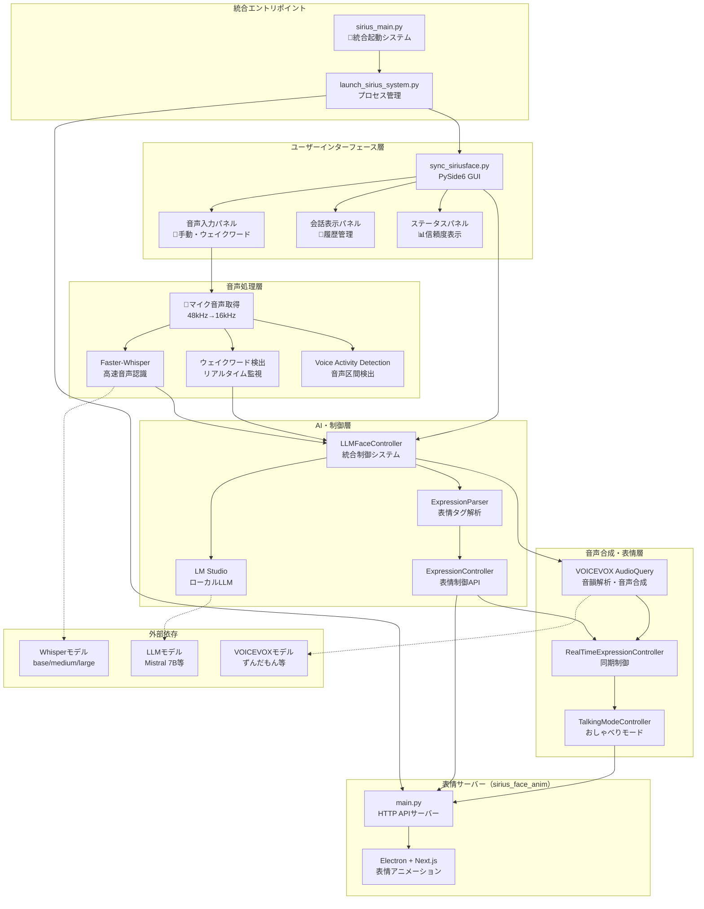

### プロセス間通信

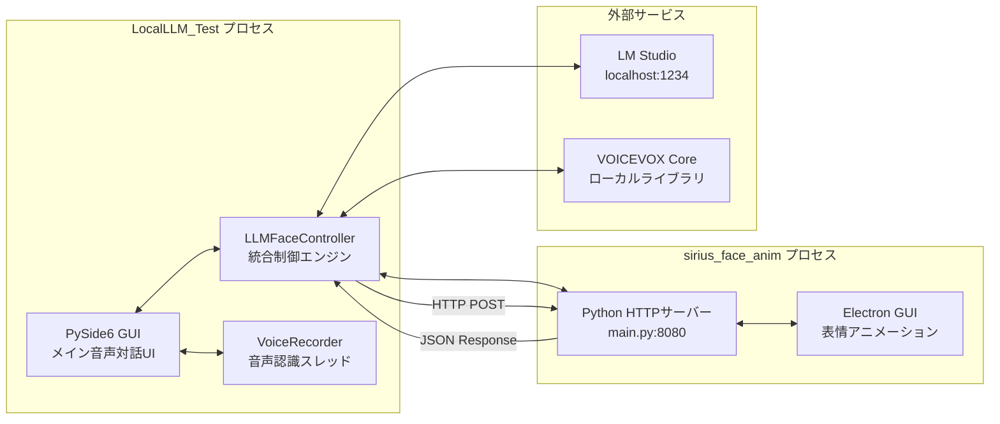

### コンポーネント階層構造

```
シリウス音声対話システム
├── 🎯 統合起動層
│   ├── sirius_main.py - エントリポイント・メニューシステム
│   └── launch_sirius_system.py - プロセス管理・自動起動
├── 💬 ユーザーインターフェース層  
│   ├── sync_siriusface.py - メイン音声対話GUI
│   ├── InputPanel - 音声入力・テキスト入力
│   ├── ConversationDisplay - 対話履歴表示
│   └── StatusPanel - システム状態・信頼度表示
├── 🎤 音声処理層
│   ├── VoiceRecorder - 音声録音・認識スレッド
│   ├── Faster-Whisper統合 - 高速音声認識エンジン
│   ├── ウェイクワード検出 - リアルタイム監視
│   └── 音声品質管理 - 信頼度計算・統計
├── 🤖 AI統合制御層
│   ├── LLMFaceController - 統合制御システム
│   ├── LMStudioClient - ローカルLLM通信
│   ├── ExpressionParser - 表情タグ解析
│   └── ExpressionValidator - タグ検証・修正
├── 🗣️ 音声・表情同期層
│   ├── AudioQueryLipSyncSpeaker - 音韻ベースリップシンク
│   ├── RealTimeExpressionController - リアルタイム表情制御
│   ├── TalkingModeController - おしゃべりモード
│   └── VOICEVOX Core統合 - 高品質音声合成
└── 🎭 表情サーバー層（sirius_face_anim）
    ├── HTTP APIサーバー (main.py) - 表情制御API
    └── Electron表情アニメーション - リアルタイム表示
```
    WakeWordDetector --> Controller
    
    Parser --> Face
    Voice_API --> Speaker
    Face --> Display
    Face --> Mouth
    VoiceRecorder --> Microphone
    
    LM -.->|表情タグ付き応答| Controller
    Controller -.->|リアルタイム同期| Display
```

### コンポーネント構成

```
シリウス音声対話システム
├── 表情サーバー (sirius_face_anim/python/main.py)
│   ├── 表情制御API (HTTP)
│   ├── 口パク制御API
│   └── おしゃべりモード制御
├── 音声対話UI (LocalLLM_Test/sync_siriusface.py)
│   ├── PySide6 GUI
│   ├── LLMコントローラー統合
│   └── リアルタイム表情制御
└── LLM統合制御 (LocalLLM_Test/llm_face_controller.py)
    ├── LM Studio クライアント
    ├── VOICEVOX AudioQuery
    └── 表情・音声同期システム
```

### 主要コンポーネント

#### 1. 統合起動システム
- `launch_sirius_system.py` - 表情サーバーとUIの同時起動・監視
- `start_sirius_system.sh` - ワンクリック起動スクリプト

#### 2. 表情制御システム
- `expression_parser.py` - 表情タグ解析・リアルタイム制御
- `expression_validator.py` - 表情タグ検証・自動修正
- `phoneme_expression_sync.py` - 音韻ベース精密同期

#### 3. LLM統合システム
- `llm_face_controller.py` - LLM・表情・音声の統合制御
- `main.py` - LM Studio クライアント
- `prompt_tuning.py` - プロンプト管理システム

#### 4. UI・対話システム
- `sync_siriusface.py` - メイン音声対話UI
- `advanced_sync_siriusface.py` - 高度なUI機能

## 🎭 表情システム

### 表情制御フロー

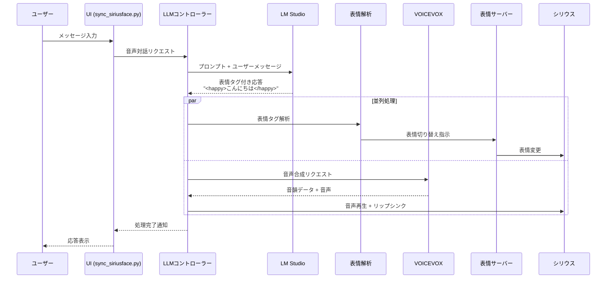

### 表情モード一覧

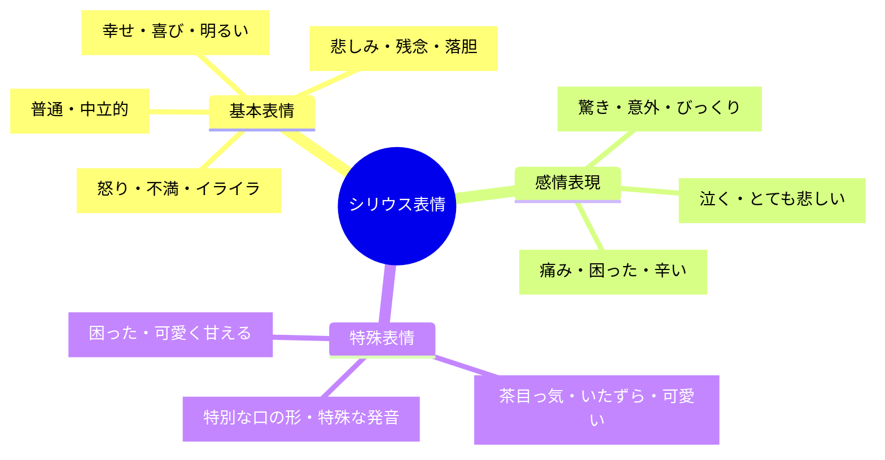

### 表情タグ仕様

表情タグは `<表情名>テキスト</表情名>` の形式で使用します。

#### 基本的な使用例
```
<happy>こんにちは！</happy>今日は<surprised>とても良い天気</surprised>ですね。
でも明日は<sad>雨の予報</sad>です。<pien>傘を忘れないでくださいね</pien>。
```

#### 特殊表情の使用例
```
<mouth3>むにゃむにゃ</mouth3>...失礼しました。
<wink>ちょっとしたジョーク</wink>でした！
<pien>ちょっと困っちゃいました</pien>。
```

### 表情切り替えのタイミング
- LLM応答テキストの解析は即座に実行
- 表情変更は音声再生と同期
- セグメント単位でのリアルタイム切り替え
- 文字数ベースの時間推定（1文字約150ms）

## 🚀 インストール

### システム要件

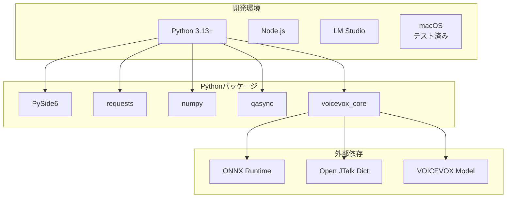

### インストールフロー

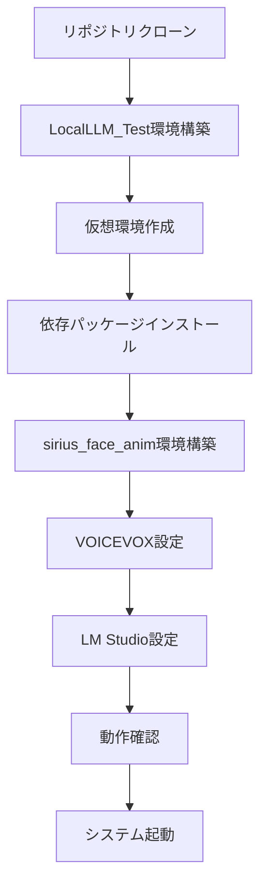

### 前提条件
- Python 3.13+
- LM Studio（ローカルLLMサーバー）
- Node.js（フロントエンド用）
- macOS（テスト済み環境）

### 環境構築

1. **リポジトリクローン**
```bash
git clone https://github.com/YakiFrog/sirius_face_anim.git
cd sirius_face_anim
```

2. **LocalLLM_Test環境設定**
```bash
cd LocalLLM_Test
python -m venv .
source bin/activate  # macOS/Linux
# または
# . bin/activate

pip install -r requirements.txt
```

3. **sirius_face_anim環境設定**
```bash
cd ../sirius_face_anim/python
python -m venv .
source bin/activate

pip install -r requirements.txt
```

### 依存パッケージ

```bash
# LocalLLM_Test環境
pip install PySide6 requests numpy qasync openai-whisper faster-whisper pyaudio SpeechRecognition

# sirius_face_anim環境  
pip install voicevox_core numpy requests websockets
```

#### 音声認識追加パッケージ
- **openai-whisper**: 高精度音声認識エンジン（従来版）
- **faster-whisper**: 高速・省メモリ音声認識エンジン（NEW!）
- **pyaudio**: 音声録音・再生ライブラリ  
- **SpeechRecognition**: 音声認識統合フレームワーク
- **ffmpeg**: 音声ファイル処理（システムレベル）
- **numpy**: 音声データ処理・数値計算

#### macOS追加設定
```bash
# HomebrewでFFmpegをインストール（Whisper用）
brew install ffmpeg

# マイクアクセス許可（システム設定で手動設定）
# システム設定 → プライバシーとセキュリティ → マイク → Python/Terminal許可
```

## 🎮 使用方法

### 🎯 統合エントリポイントからの起動（推奨）

#### メインエントリ起動
```bash
cd LocalLLM_Test
python sirius_main.py
```

**起動メニュー**:
```
🎭 シリウス音声対話システム
==================================================
1. システム統合起動 (推奨)          # 全機能フル起動
2. 音声対話UIのみ起動              # デバッグ用単体起動  
3. テストメニュー                   # 各システムの単体テスト
==================================================
選択してください (1-3): 
```

#### 各オプションの詳細

**1. システム統合起動（推奨）**
- 表情サーバー（sirius_face_anim）の自動起動
- 音声対話UI（sync_siriusface.py）の自動起動
- プロセス間連携の自動確立
- フル機能での完全統合システム

**2. 音声対話UIのみ起動**
- 表情サーバーが別途起動済みの場合に使用
- デバッグ・テスト用の単体起動モード
- UI機能のみの検証時

**3. テストメニュー**
- 表情システムテスト (`test_sirius_expressions.py`)
- LLM接続テスト (`test_mistral_model.py`)  
- 音声認識テスト (`detailed_mic_test.py`)
- 各コンポーネントの単体動作確認

### 🛠️ 従来の起動方法（デバッグ・開発用）

#### 統合システム起動
```bash
cd LocalLLM_Test
source bin/activate
python utils/launch_sirius_system.py
```

#### 個別起動（完全手動）
```bash
# 1. 表情サーバー起動（ターミナル1）
cd sirius_face_anim/python
source bin/activate
python main.py

# 2. 音声対話UI起動（ターミナル2）
cd LocalLLM_Test  
source bin/activate
python ui/sync_siriusface.py
```

### 🖱️ UI操作方法

#### テキスト入力
1. **メッセージ入力**: テキストエリアにメッセージを入力
2. **送信**: 
   - 「送信」ボタンクリック
   - Cmd+Enter（macOS）/ Ctrl+Enter（Windows）
3. **入力クリア**: Escキーで入力欄をクリア

#### 🎤 音声入力機能

**手動音声録音**:
1. 「🎤 音声入力開始」ボタンをクリック
2. Vキーでのショートカット操作も可能  
3. マイクに向かって**明瞭に**日本語で発話
   - 推奨録音時間: 1-10秒
   - 推奨距離: マイクから10-15cm
   - 静音環境での録音
4. 2秒以上の無音で自動録音終了
5. 音声→テキスト自動変換・入力欄に挿入
6. 高精度（80%以上）時は確認なしで自動送信

#### 🔊 ウェイクワード音声対話（完全ハンズフリー）

**リアルタイム監視モード**:
1. **監視開始**: 「リアルタイム監視 開始」ボタンをクリック
2. **ウェイクワード発声**: 以下のいずれかを**はっきりと**発声
   - 🎯 **推奨**: 「こんにちは」（最も認識精度が高い）
   - 「シリウスくん」「シリウス君」「しりうすくん」
   - 「シリウス」「しりうす」「シリウスさん」
   - 「おはよう」「起きて」

3. **自動応答フロー**:
   ```
   ユーザー: 「こんにちは」
   → システム: 「はい、なんですか」（自動応答）
   → 自動音声録音開始（3秒後）
   → ユーザー発話
   → 2秒無音で自動停止
   → 音声認識・自動送信
   → LLM応答・表情制御・音声合成
   ```

4. **完全ハンズフリー体験**:
   - キーボード・マウス操作一切不要
   - 音声のみでの完全対話システム
   - 連続対話も可能（再度ウェイクワードで起動）

#### 設定・機能切り替え
- **表情選択**: 会話開始時の初期表情
- **LLMモデル設定**: 使用するAIモデルの動作パラメータ
- **プロンプト選択**: 会話の性格・スタイル・専門性
- **Whisperモデル切り替え**: base（軽量）/medium（推奨）/large（高精度）
- **マイク選択**: 使用するマイクデバイス
- **音声設定**: 自動送信・沈黙検出・信頼度閾値

#### 品質管理・監視機能
- **音声認識信頼度**: リアルタイム表示（0-100%）
- **認識統計**: 平均・最小・最大信頼度
- **システムログ**: 対話・エラー・接続状況の表示
- **会話履歴**: 最大10件の対話履歴保持・表示

### 📋 利用可能プロンプト

| プロンプト名 | 特徴 | 用途 |
|-------------|------|------|
| `sirius_expressions` | **表情タグ専用**（推奨） | 自然な表情表現対話 |
| `emotional` | 感情豊かな応答 | 日常的な感情表現 |
| `casual` | フレンドリーな会話 | リラックス対話 |
| `technical` | 専門的な説明 | 技術解説・学習 |
| `educational` | 教育的でわかりやすい | 学習サポート |
| `weather_guide` | 天気案内専用 | 気象情報提供 |
| `news_reporter` | ニュース報道調 | 情報伝達・報告 |
| `counselor` | カウンセリング調 | 相談・サポート |
| `creative` | 創作・アイデア支援 | 創造的作業 |
| `formal` | フォーマルな対応 | 公式・ビジネス |
| `english` | 英語対話 | 英語学習・練習 |

## ⚙️ 設定

### 🎤 音声入力設定

#### Faster-Whisper設定（NEW!）
```python
# VoiceRecorder クラス内設定（高速化版）
faster_whisper_settings = {
    "model_size": "medium",              # 精度と速度のバランス（base/medium/large）
    "device": "cpu",                     # CPU最適化
    "compute_type": "int8",              # 8bit量子化で50%メモリ削減
    "language": "ja",                    # 日本語特化
    "temperature": 0.0,                  # 決定論的出力
    "beam_size": 3,                      # ビームサーチで精度向上
    "no_speech_threshold": 0.2,          # 音声なし判定を緩く
    "condition_on_previous_text": False, # 前テキストに依存しない
    "vad_filter": True,                  # Voice Activity Detection有効
    "vad_parameters": {
        "min_silence_duration_ms": 500   # 短い無音期間を許容
    }
}
```

#### ウェイクワード検出設定（NEW!）
```python
# リアルタイム監視設定
wake_word_settings = {
    "wake_words": [
        "シリウスくん", "シリウス君", "しりうすくん",  # メインワード
        "シリウス", "しりうす", "シリウスさん",        # 簡略形
        "こんにちは", "おはよう", "起きて"             # 代替ワード
    ],
    "sample_rate": 48000,                # MacBook Air マイク最適化
    "chunk_size": 1024,                  # バッファサイズ
    "buffer_duration": 3.0,              # 音声バッファ時間（秒）
    "check_interval": 1.5,               # 検出間隔（秒）
    "volume_threshold": 20,              # 音声レベル閾値（低感度）
    "device_index": 1,                   # MacBook Air内蔵マイク
    "auto_response": "はい、なんですか"    # ウェイクワード検出時応答
}
```

#### 音声録音設定
```python
# VoiceRecorder音質設定
audio_settings = {
    "sample_rate": 48000,        # MacBook Air マイク最適化
    "target_sample_rate": 16000, # Whisper用リサンプリング
    "chunk_size": 1024,          # バッファサイズ
    "channels": 1,               # モノラル録音
    "format": "paInt16",         # 16bit PCM
    "min_record_time": 1.0,      # 最小録音時間（秒）
    "silence_threshold": 2.0,    # 自動停止の無音時間（秒）
    "auto_send_threshold": 0.8   # 自動送信の信頼度閾値（80%）
}
```

#### 音声認識最適化のコツ
1. **📍 マイク距離**: 5-10cm の至近距離
2. **🔇 静音環境**: エアコン・ファンなどのノイズを最小化
3. **🗣️ 明瞭な発音**: ゆっくり・はっきりと話す
4. **⏱️ 適切な長さ**: 1-10秒程度の発話
5. **⏸️ 間を置く**: 話し終わったら1秒程度待ってから停止
6. **🎯 ウェイクワード**: 「こんにちは」が最も認識しやすい
7. **🔊 音量調整**: マイクの音量を最大レベルに設定

### 設定ファイル

#### `prompt_configs.json` - LLMモデル設定
```json
{
  "llm_settings": {
    "mistral_default": {
      "model": "mistralai/magistral-small-2509",
      "temperature": 0.7,
      "max_tokens": -1
    },
    "mistral_creative": {
      "model": "mistralai/magistral-small-2509", 
      "temperature": 0.9,
      "max_tokens": 200
    }
  }
}
```

#### プロンプトファイル（`prompts/`ディレクトリ）
- `*.txt` - 各プロンプトの内容
- 表情タグの使用ガイドライン含む
- カスタムプロンプトの追加可能

### 環境変数・パス設定

#### VOICEVOX設定
```python
voicevox_config = {
    "voicevox_onnxruntime_path": "/.../libvoicevox_onnxruntime.1.17.3.dylib",
    "open_jtalk_dict_dir": "/.../open_jtalk_dic_utf_8-1.11", 
    "model_path": "/.../13.vvm",
    "dialogue_file_path": "/.../dialogue_data.json"
}
```

#### サーバー設定
- **LM Studio URL**: `http://127.0.0.1:1234`
- **表情サーバーURL**: `http://localhost:8080`

## 📡 API仕様

### システム間通信

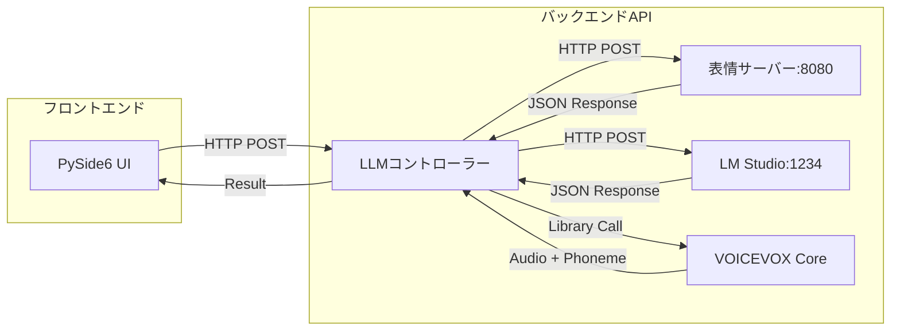

### 表情制御API

#### 表情設定
```http
POST /expression
Content-Type: application/json

{
  "expression": "happy"
}
```

#### 口パターン設定
```http
POST /mouth_pattern  
Content-Type: application/json

{
  "mouth_pattern": "mouth_a"
}
```

#### おしゃべりモード設定
```http
POST /talking_mouth_mode
Content-Type: application/json

{
  "talking_mouth_mode": true
}
```

#### 状態取得
```http
GET /status

Response:
{
  "status": "success",
  "data": {
    "expression": "happy",
    "display_mode": "face", 
    "talking_mouth_mode": true,
    "mouth_pattern": "mouth_a",
    "is_blinking": true,
    "blink_interval": 3.0
  }
}
```

### データフロー

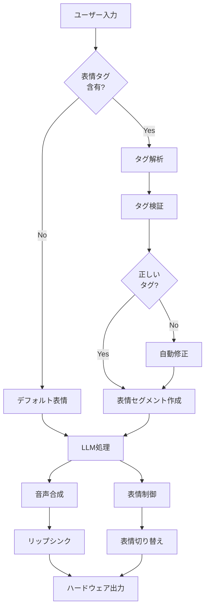

### LLM統合API

#### プログラム内部API
```python
# LLMFaceController使用例
controller = LLMFaceController()
result = await controller.process_user_input("こんにちは", "happy")

# 表情タグ付きテキストの発話
success = await controller.speak_with_lipsync(
    "<happy>嬉しいです</happy>",
    enable_expression_parsing=True
)
```

## 🧪 テスト

### テストスクリプト

```bash
# 表情システムテスト
python test_sirius_expressions.py

# 表情解析テスト
python test_expression_system.py

# 表情タグ検証テスト
python expression_validator.py

# LLMモデルテスト
python test_mistral_model.py
```

### 動作確認項目

1. **表情切り替え**: 各表情モードの正常動作
2. **音声合成**: VOICEVOX AudioQueryによる音声出力
3. **リップシンク**: 音韻データと口パクの同期
4. **表情タグ解析**: LLM応答の正確な解析
5. **自動タグ修正**: 不正タグの検出・修正

## 🔧 トラブルシューティング

### よくある問題

#### 🎤 音声入力関連

##### 1. 音声が認識されない
- **原因**: マイクアクセス許可がない
- **解決**: 
  ```bash
  # macOS: システム設定でマイクアクセスを許可
  システム設定 → プライバシーとセキュリティ → マイク → Terminal/Python を許可
  ```

##### 2. 認識精度が低い
- **原因**: 環境音・マイク距離・発音
- **解決**:
  - マイクから5-10cm の距離で話す
  - 静かな環境で録音
  - はっきりと明瞭に発音
  - 1-10秒の適切な長さで話す

##### 3. ウェイクワード検出が反応しない（NEW!）
- **原因**: 音声レベル閾値が高すぎる・マイク設定
- **解決**:
  - マイク音量を最大レベルに設定
  - より認識しやすい「こんにちは」「おはよう」を試す
  - マイクに近づいて（5cm以内）明確に発音
  - システム音量とは別にマイク入力音量を確認

##### 4. Faster-Whisperモデルのロードが遅い（NEW!）
- **原因**: mediumモデルのサイズ（約1.5GB）
- **解決**:
  - 初回のみダウンロードが発生（時間がかかる）
  - 十分なストレージ容量を確保（3GB以上推奨）
  - ネットワーク環境を確認

##### 5. "FP16 is not supported on CPU"警告
- **原因**: CPUでのFP16処理警告（正常動作）
- **解決**: 警告は自動で抑制済み・動作に影響なし

##### 6. リアルタイム監視が停止する
- **原因**: 長時間の無音・システムリソース不足
- **解決**:
  - 監視ボタンを再クリックして再開
  - システムのCPU使用率を確認
  - メモリ不足の場合は他のアプリを終了

#### 🎭 システム全般

##### 1. 音声が出ない
- **原因**: VOICEVOX設定パスが不正
- **解決**: `llm_face_controller.py`のvoicevox_configを確認

##### 2. 表情が変わらない
- **原因**: 表情サーバー未起動 or 接続エラー
- **解決**: `python main.py`で表情サーバーを起動

##### 3. LLM応答がない
- **原因**: LM Studio未起動 or モデル未ロード
- **解決**: LM Studioでモデルをロードして起動

##### 4. 表情タグが認識されない
- **原因**: 不正なタグ形式
- **解決**: `<表情名>テキスト</表情名>`の正しい形式を使用

### ログ確認

```bash
# 統合システムのログ確認
python launch_sirius_system.py

# 個別コンポーネントのログ
python sync_siriusface.py  # UI側
python main.py            # 表情サーバー側
```

### デバッグモード

```python
# ログレベル変更
import logging
logging.basicConfig(level=logging.DEBUG)
```

## 📁 最新ファイル構成

### プロジェクト構造

```
シリウス音声対話プロジェクト/
├── LocalLLM_Test/                  # 🎯音声対話・制御系システム
│   ├── sirius_main.py             # 🎯統合エントリポイント
│   ├── prompt_configs.json        # LLMモデル設定
│   ├── requirements.txt           # Python依存パッケージ
│   ├── core/                      # コア制御システム  
│   │   ├── main.py               # LM Studio クライアント
│   │   ├── llm_face_controller.py # 統合制御エンジン
│   │   ├── expression_parser.py  # 表情タグ解析
│   │   ├── expression_validator.py # タグ検証・修正
│   │   └── phoneme_expression_sync.py # 音韻同期
│   ├── ui/                       # ユーザーインターフェース
│   │   └── sync_siriusface.py    # メイン音声対話GUI
│   ├── utils/                    # ユーティリティ
│   │   ├── launch_sirius_system.py # プロセス管理・統合起動
│   │   └── prompt_tuning.py      # プロンプト管理
│   ├── tests/                    # テストスクリプト
│   │   ├── test_sirius_expressions.py # 表情システムテスト
│   │   ├── test_mistral_model.py     # LLMテスト
│   │   └── detailed_mic_test.py      # 音声認識テスト
│   ├── prompts/                  # プロンプトファイル
│   │   ├── sirius_expressions.txt # 表情専用（推奨）
│   │   ├── emotional.txt         # 感情豊か
│   │   ├── casual.txt           # カジュアル
│   │   ├── technical.txt        # 技術説明
│   │   ├── educational.txt      # 教育的
│   │   ├── weather_guide.txt    # 天気案内
│   │   ├── news_reporter.txt    # ニュース報道
│   │   ├── counselor.txt        # カウンセリング
│   │   ├── creative.txt         # 創作支援
│   │   ├── formal.txt           # フォーマル
│   │   └── english.txt          # 英語対話
│   └── bin/                     # Python仮想環境
│       ├── python, python3     # Python実行ファイル
│       └── activate             # 仮想環境アクティベート
└── sirius_face_anim/             # 🎭表情・視覚系システム  
    ├── package.json             # Node.js設定
    ├── electron-builder.yml     # Electronビルド設定
    ├── tsconfig.json           # TypeScript設定
    ├── main/                   # Electronメインプロセス
    │   ├── background.ts       # メインプロセスエントリ
    │   └── preload.ts         # プリロード
    ├── renderer/               # Next.js + React GUI
    │   ├── components/
    │   │   └── P5Sketch.tsx   # メイン表情アニメーション
    │   ├── pages/
    │   │   ├── home.tsx       # ホームページ
    │   │   └── _app.tsx       # Next.js設定
    │   ├── types/
    │   │   └── FaceAnimationTypes.ts # 表情型定義
    │   └── utils/             # アニメーション制御
    │       ├── FaceRenderer.ts    # 表情レンダリング
    │       ├── ExpressionManager.ts # 表情管理
    │       ├── MouthPatternController.ts # 口パク制御
    │       └── TalkingMode.ts     # おしゃべりモード
    ├── python/                 # Python HTTPサーバー
    │   ├── main.py            # 🎯表情制御APIサーバー
    │   ├── audioquery_phoneme.py # 音韻解析システム
    │   ├── voicevox_lipsync.py   # リップシンク制御
    │   ├── dialogue_data.json    # 対話データ
    │   ├── requirements.txt      # Python依存パッケージ
    │   ├── voicevox_core/       # VOICEVOX統合
    │   │   ├── models/         # 音声モデル（ずんだもん等）
    │   │   ├── dict/           # Open JTalk辞書
    │   │   └── onnxruntime/    # ONNX Runtime
    │   └── bin/               # Python仮想環境
    │       ├── python, python3
    │       └── activate
    └── app/                   # Electronビルド出力
        ├── background.js      # コンパイル済みメイン
        ├── preload.js        
        └── _next/            # Next.jsビルド出力
```

### 主要コンポーネント別機能

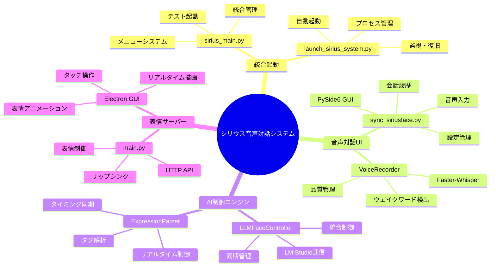

### 依存関係マッピング

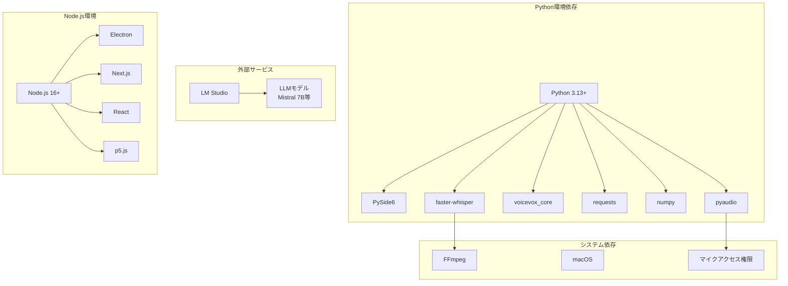

## 🔮 今後の開発予定

### 開発ロードマップ

```mermaid
timeline
    title シリウス音声対話システム開発計画
    
    section フェーズ1 : 基盤機能
        現在 : リアルタイム表情制御 : 音韻ベースリップシンク : LLM統合システム
        
    section フェーズ2 : 短期改善
        2025Q1 : 音韻ベース精密同期 : 表情遷移アニメーション : エラーハンドリング強化
        
    section フェーズ3 : 機能拡張  
        2025Q2 : 音声感情認識統合 : カスタム表情追加 : パフォーマンス最適化
        
    section フェーズ4 : 高度機能
        2025Q3 : 複数話者対応 : リアルタイム感情分析 : 多言語対応
        
    section フェーズ5 : 統合・展開
        2025Q4 : Web API化 : クラウド統合 : 商用化準備
```

### 技術スタック進化

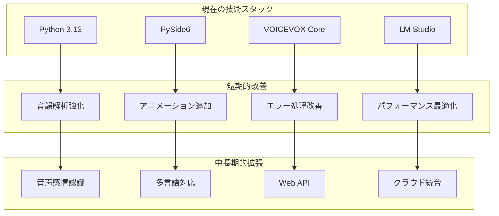

## 📄 ライセンス・プロジェクト情報

### ライセンス
このプロジェクトはMITライセンスのもとで公開されています。研究・教育・商用利用が可能です。

### プロジェクト詳細
- **プロジェクト名**: シリウス音声対話統合システム
- **バージョン**: 2.0.0（統合エントリポイント対応版）
- **最終更新**: 2025年1月25日
- **開発環境**: macOS (Apple Silicon対応)
- **テスト環境**: Python 3.13 + PySide6 + Faster-Whisper + LM Studio

### 技術スタック
**フロントエンド・GUI**:
- PySide6 (メイン音声対話UI)
- Electron + Next.js + React (表情アニメーション)
- p5.js (リアルタイム描画)

**バックエンド・AI**:
- Faster-Whisper (高速音声認識)  
- LM Studio (ローカルLLM)
- VOICEVOX AudioQuery (音声合成・音韻解析)
- Python 3.13 (システム統合)

**システム統合**:
- HTTP API (プロセス間通信)
- WebSocket (リアルタイム同期)
- マルチプロセス管理 (統合起動システム)

## 👥 開発・貢献者

### 開発者
- **メイン開発者**: [YakiFrog](https://github.com/YakiFrog)
- **プロジェクト**: 屋外自律移動ロボット「シリウス」
- **所属**: NLAB (Nakamura Laboratory)

### 貢献方法
バグ報告、機能要求、プルリクエストを歓迎します：

1. **Issue**: バグ報告や機能要求
2. **Pull Request**: コード改善や新機能追加  
3. **Discussion**: アイデアや提案
4. **Documentation**: ドキュメント改善

### 開発ガイドライン
- コード品質: PEP 8準拠、型ヒント推奨
- テスト: 新機能追加時の動作確認必須
- ドキュメント: API変更時のREADME更新

## 📞 サポート・連絡先

### 技術サポート
- **GitHub Issues**: [sirius_face_anim/issues](https://github.com/YakiFrog/sirius_face_anim/issues)
- **動作環境**: macOS (テスト済み), Linux (未テスト), Windows (未テスト)
- **推奨スペック**: メモリ8GB以上、CPU: M1/M2 or Intel i5以上

### よくある質問
1. **Q**: Windowsで動作しますか？
   **A**: 理論上可能ですが、未テストです。パス設定の調整が必要です。

2. **Q**: GPUは必要ですか？
   **A**: 不要です。CPU のみでFaster-Whisperが高速動作します。

3. **Q**: 他のLLMモデルは使用可能ですか？
   **A**: LM Studio対応モデル（Mistral, Llama等）すべて使用可能です。

4. **Q**: 商用利用は可能ですか？
   **A**: MITライセンスのため可能ですが、使用モデルのライセンスもご確認ください。

### 更新情報
- **v2.0.0**: 統合エントリポイント追加、プロセス管理強化
- **v1.5.0**: Faster-Whisper統合、ウェイクワード対応
- **v1.0.0**: 基本音声対話システム、表情制御統合

---

🎭 **シリウス音声対話システム v2.0** - 統合エントリポイントでより使いやすく、より自然で感情豊かな対話を実現
