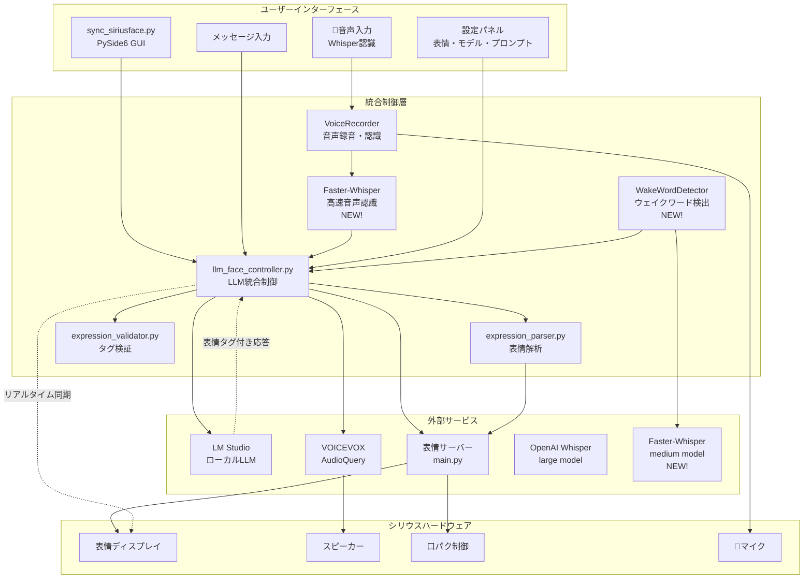
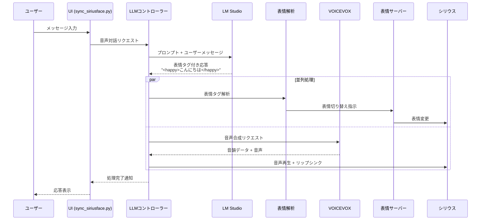
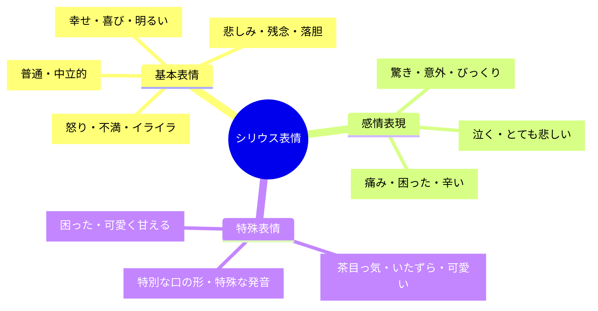
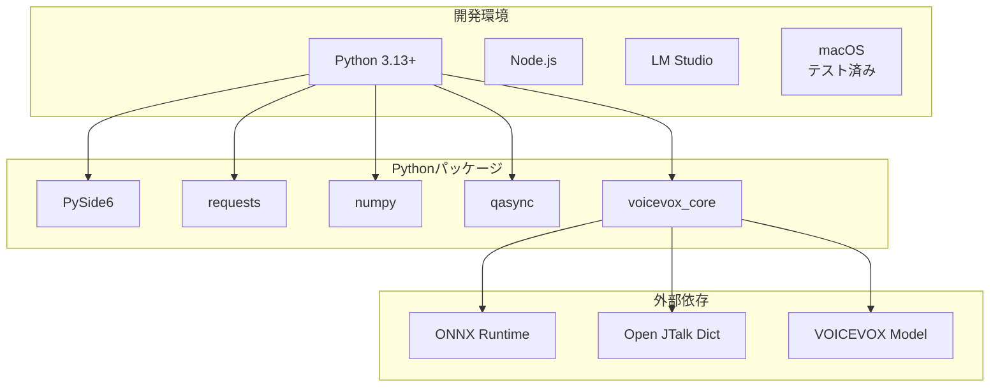
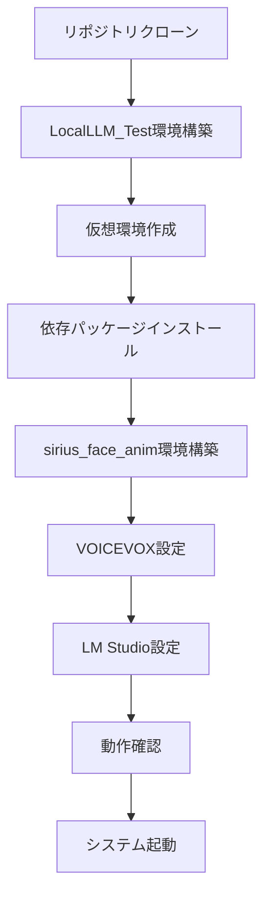
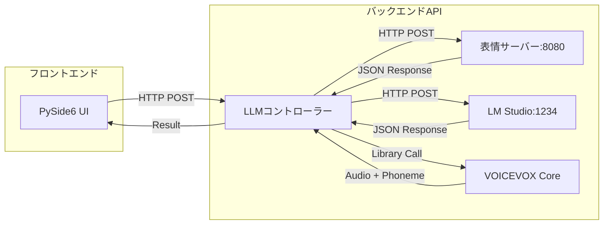
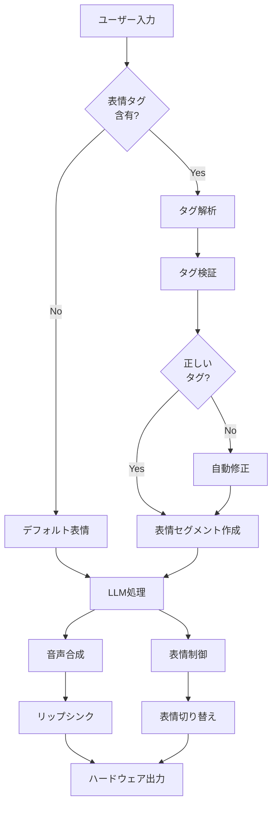
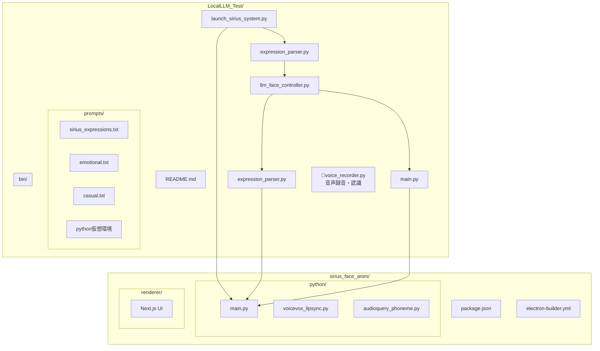
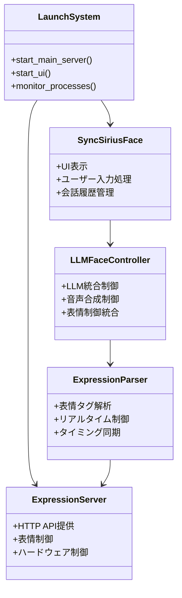
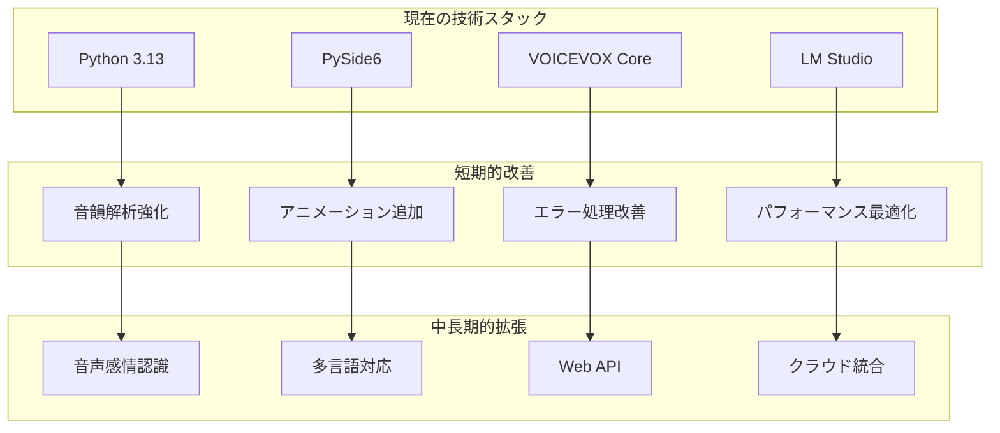

# 🎭 シリウス音声対話システム

ローカルLLM（LM Studio）とVOICEVOX AudioQuery音韻解析を統合した表情・音声対話システム

## 📋 目次

- [概要](#概要)
- [主な機能](#主な機能)
- [システム構成](#システム構成)
- [表情システム](#表情システム)
- [インストール](#インストール)
- [使用方法](#使用方法)
- [設定](#設定)
- [API仕様](#api仕様)
- [トラブルシューティング](#トラブルシューティング)

## 🎯 概要

シリウス音声対話システムは、屋外自律移動ロボット「シリウス」のための高度な音声対話システムです。ローカルLLMによる自然な会話と、表情タグによるリアルタイム表情切り替え、VOICEVOX AudioQueryによる高品質な音声合成・リップシンクを統合しています。

### 特徴

- 🤖 **ローカルLLM統合**: LM Studio経由でMistral等のモデルを使用
- � **高精度音声入力**: OpenAI Whisper largeモデルによる日本語音声認識
- �🎭 **リアルタイム表情制御**: 会話内容に応じた自動表情切り替え
- 🗣️ **高品質音声合成**: VOICEVOX AudioQueryによる自然な音声
- 👄 **精密リップシンク**: 音韻データに基づく口パク制御
- 🎨 **表情タグシステム**: LLM応答での感情表現
- 🖥️ **統合UI**: PySide6によるモダンなユーザーインターface
- 🎯 **ハンズフリー操作**: 音声入力による完全音声対話システム

## ✨ 主な機能

### 🤖 音声対話機能
- ローカルLLMとの自然な日本語会話
- 会話履歴の管理（最大10件）
- 複数のプロンプト設定（カジュアル、技術的、教育的など）
- LLMモデル設定の動的変更

### 🎤 音声入力機能（NEW!）
- **高精度音声認識**: OpenAI Whisper（largeモデル）とFaster-Whisper（mediumモデル）による日本語音声認識
- **音声入力方式**:
  - **手動録音**: ワンクリックで音声録音開始・停止
  - **キーボードショートカット**: Vキーで音声入力のトグル操作
  - **自動停止**: 2秒以上の無音状態で自動的に録音終了
- **ウェイクワード検出（NEW!）**: 
  - **リアルタイム監視**: 常時マイクから音声を監視
  - **ウェイクワード**: 「シリウスくん」「シリウス」「こんにちは」「おはよう」など
  - **自動応答**: ウェイクワード検出時に「はい、なんですか」と応答
  - **ハンズフリー**: ウェイクワード後、自動的に音声入力開始
- **音声品質最適化**: 
  - 48kHz サンプリングレート（MacBook Air最適化）
  - 16kHz リサンプリング（Whisper最適化）
  - ノイズ除去・音量正規化
  - 最小録音時間制限（1秒以上）
- **視覚的フィードバック**: 録音状態の色彩表示・進行状況表示
- **自動テキスト変換**: 音声からテキストへの自動変換・入力欄への自動挿入
- **自動送信**: 高精度（80%以上）の音声認識結果を確認なしで自動送信
- **高精度設定**:
  - Faster-Whisperによる2-4倍高速化と50%メモリ削減
  - 決定論的出力（temperature=0.0）
  - ビームサーチ最適化（beam_size=3）
  - 日本語特化設定
  - Voice Activity Detection（VAD）フィルター

### �🎭 表情制御機能
- **10種類の表情モード**:
  - `neutral` - 普通・中立的
  - `happy` - 幸せ・喜び・明るい
  - `sad` - 悲しみ・残念・落胆
  - `angry` - 怒り・不満・イライラ
  - `surprised` - 驚き・意外・びっくり
  - `crying` - 泣く・とても悲しい
  - `hurt` - 痛み・困った・辛い
  - `wink` - 茶目っ気・いたずら・可愛い
  - `mouth3` - 特別な口の形・特殊な発音
  - `pien` - 困った・可愛く甘える

- **表情タグシステム**: `<happy>嬉しいです</happy>`形式でリアルタイム表情切り替え
- **自動タグ修正**: 不正な表情タグの自動検出・修正

### 🗣️ 音声・リップシンク機能
- VOICEVOX AudioQueryによる高品質音声合成
- 音韻データに基づく精密なリップシンク
- おしゃべりモードでの口パターン制御
- 表情変化と音声再生の同期

## 🏗️ システム構成

### システムアーキテクチャ



### コンポーネント構成

```
シリウス音声対話システム
├── 表情サーバー (sirius_face_anim/python/main.py)
│   ├── 表情制御API (HTTP)
│   ├── 口パク制御API
│   └── おしゃべりモード制御
├── 音声対話UI (LocalLLM_Test/sync_siriusface.py)
│   ├── PySide6 GUI
│   ├── LLMコントローラー統合
│   └── リアルタイム表情制御
└── LLM統合制御 (LocalLLM_Test/llm_face_controller.py)
    ├── LM Studio クライアント
    ├── VOICEVOX AudioQuery
    └── 表情・音声同期システム
```

### 主要コンポーネント

#### 1. 統合起動システム
- `launch_sirius_system.py` - 表情サーバーとUIの同時起動・監視
- `start_sirius_system.sh` - ワンクリック起動スクリプト

#### 2. 表情制御システム
- `expression_parser.py` - 表情タグ解析・リアルタイム制御
- `expression_validator.py` - 表情タグ検証・自動修正
- `phoneme_expression_sync.py` - 音韻ベース精密同期

#### 3. LLM統合システム
- `llm_face_controller.py` - LLM・表情・音声の統合制御
- `main.py` - LM Studio クライアント
- `prompt_tuning.py` - プロンプト管理システム

#### 4. UI・対話システム
- `sync_siriusface.py` - メイン音声対話UI
- `advanced_sync_siriusface.py` - 高度なUI機能

## 🎭 表情システム

### 表情制御フロー



### 表情モード一覧



### 表情タグ仕様

表情タグは `<表情名>テキスト</表情名>` の形式で使用します。

#### 基本的な使用例
```
<happy>こんにちは！</happy>今日は<surprised>とても良い天気</surprised>ですね。
でも明日は<sad>雨の予報</sad>です。<pien>傘を忘れないでくださいね</pien>。
```

#### 特殊表情の使用例
```
<mouth3>むにゃむにゃ</mouth3>...失礼しました。
<wink>ちょっとしたジョーク</wink>でした！
<pien>ちょっと困っちゃいました</pien>。
```

### 表情切り替えのタイミング
- LLM応答テキストの解析は即座に実行
- 表情変更は音声再生と同期
- セグメント単位でのリアルタイム切り替え
- 文字数ベースの時間推定（1文字約150ms）

## 🚀 インストール

### システム要件



### インストールフロー



### 前提条件
- Python 3.13+
- LM Studio（ローカルLLMサーバー）
- Node.js（フロントエンド用）
- macOS（テスト済み環境）

### 環境構築

1. **リポジトリクローン**
```bash
git clone https://github.com/YakiFrog/sirius_face_anim.git
cd sirius_face_anim
```

2. **LocalLLM_Test環境設定**
```bash
cd LocalLLM_Test
python -m venv .
source bin/activate  # macOS/Linux
# または
# . bin/activate

pip install -r requirements.txt
```

3. **sirius_face_anim環境設定**
```bash
cd ../sirius_face_anim/python
python -m venv .
source bin/activate

pip install -r requirements.txt
```

### 依存パッケージ

```bash
# LocalLLM_Test環境
pip install PySide6 requests numpy qasync openai-whisper faster-whisper pyaudio SpeechRecognition

# sirius_face_anim環境  
pip install voicevox_core numpy requests websockets
```

#### 音声認識追加パッケージ
- **openai-whisper**: 高精度音声認識エンジン（従来版）
- **faster-whisper**: 高速・省メモリ音声認識エンジン（NEW!）
- **pyaudio**: 音声録音・再生ライブラリ  
- **SpeechRecognition**: 音声認識統合フレームワーク
- **ffmpeg**: 音声ファイル処理（システムレベル）
- **numpy**: 音声データ処理・数値計算

#### macOS追加設定
```bash
# HomebrewでFFmpegをインストール（Whisper用）
brew install ffmpeg

# マイクアクセス許可（システム設定で手動設定）
# システム設定 → プライバシーとセキュリティ → マイク → Python/Terminal許可
```

## 🎮 使用方法

### 基本的な使用方法

#### 1. 統合システム起動（推奨）
```bash
cd LocalLLM_Test
./start_sirius_system.sh
```

#### 2. 個別起動
```bash
# 仮想環境アクティベート
cd LocalLLM_Test
source bin/activate

# 統合システム起動
python launch_sirius_system.py
```

#### 3. 手動起動（デバッグ用）
```bash
# 1. 表情サーバー起動
cd sirius_face_anim/python
source bin/activate
python main.py

# 2. 音声対話UI起動（別ターミナル）
cd LocalLLM_Test  
source bin/activate
python sync_siriusface.py
```

### UI操作方法

#### テキスト入力
1. **メッセージ入力**: テキストエリアにメッセージを入力
2. **送信**: 
   - 送信ボタンクリック
   - Cmd+Enter（macOS）/ Ctrl+Enter（Windows）
3. **入力クリア**: Escキーで入力欄をクリア

#### 🎤 音声入力（NEW!）
1. **手動音声入力**:
   - 「🎤 音声入力開始」ボタンをクリック
   - Vキーでのショートカット操作も可能
2. **音声録音**: マイクに向かって**はっきりと**日本語で話す
   - 推奨録音時間: 1-10秒
   - 推奨距離: マイクから5-10cm
   - 静かな環境で録音
3. **自動停止**: 2秒以上の無音で自動的に録音終了
4. **自動変換**: 音声が自動的にテキストに変換され入力欄に挿入
5. **自動送信**: 高精度（80%以上）の場合、確認なしで自動送信

#### 🔊 ウェイクワード音声入力（NEW!）
1. **リアルタイム監視開始**: 「リアルタイム監視」ボタンをクリック
2. **ウェイクワード発声**: 以下のいずれかをはっきりと発声
   - 「シリウスくん」（推奨）
   - 「シリウス」
   - 「こんにちは」（認識しやすい）
   - 「おはよう」
   - 「起きて」
3. **自動応答**: システムが「はい、なんですか」と応答
4. **音声入力開始**: 自動的に音声録音が開始
5. **完全ハンズフリー**: 以降は自動停止・認識・送信まで自動実行

#### 設定変更
- **表情**: 初期表情を選択
- **LLMモデル**: 使用するモデル設定
- **プロンプト**: 会話の性格・スタイル

#### その他機能  
- **履歴クリア**: 会話履歴をリセット
- **プロンプト編集**: 「編集」ボタンでカスタムプロンプト作成

### プロンプト管理

利用可能なプロンプト：
- `sirius_expressions` - シリウス表情専用（推奨）
- `emotional` - 基本的な感情表現
- `casual` - カジュアルな会話
- `technical` - 技術的な対話
- `educational` - 教育的な説明
- `weather_guide` - 天気案内専用
- `news_reporter` - ニュース報道専用

## ⚙️ 設定

### 🎤 音声入力設定

#### Faster-Whisper設定（NEW!）
```python
# VoiceRecorder クラス内設定（高速化版）
faster_whisper_settings = {
    "model_size": "medium",              # 精度と速度のバランス（base/medium/large）
    "device": "cpu",                     # CPU最適化
    "compute_type": "int8",              # 8bit量子化で50%メモリ削減
    "language": "ja",                    # 日本語特化
    "temperature": 0.0,                  # 決定論的出力
    "beam_size": 3,                      # ビームサーチで精度向上
    "no_speech_threshold": 0.2,          # 音声なし判定を緩く
    "condition_on_previous_text": False, # 前テキストに依存しない
    "vad_filter": True,                  # Voice Activity Detection有効
    "vad_parameters": {
        "min_silence_duration_ms": 500   # 短い無音期間を許容
    }
}
```

#### ウェイクワード検出設定（NEW!）
```python
# リアルタイム監視設定
wake_word_settings = {
    "wake_words": [
        "シリウスくん", "シリウス君", "しりうすくん",  # メインワード
        "シリウス", "しりうす", "シリウスさん",        # 簡略形
        "こんにちは", "おはよう", "起きて"             # 代替ワード
    ],
    "sample_rate": 48000,                # MacBook Air マイク最適化
    "chunk_size": 1024,                  # バッファサイズ
    "buffer_duration": 3.0,              # 音声バッファ時間（秒）
    "check_interval": 1.5,               # 検出間隔（秒）
    "volume_threshold": 20,              # 音声レベル閾値（低感度）
    "device_index": 1,                   # MacBook Air内蔵マイク
    "auto_response": "はい、なんですか"    # ウェイクワード検出時応答
}
```

#### 音声録音設定
```python
# VoiceRecorder音質設定
audio_settings = {
    "sample_rate": 48000,        # MacBook Air マイク最適化
    "target_sample_rate": 16000, # Whisper用リサンプリング
    "chunk_size": 1024,          # バッファサイズ
    "channels": 1,               # モノラル録音
    "format": "paInt16",         # 16bit PCM
    "min_record_time": 1.0,      # 最小録音時間（秒）
    "silence_threshold": 2.0,    # 自動停止の無音時間（秒）
    "auto_send_threshold": 0.8   # 自動送信の信頼度閾値（80%）
}
```

#### 音声認識最適化のコツ
1. **📍 マイク距離**: 5-10cm の至近距離
2. **🔇 静音環境**: エアコン・ファンなどのノイズを最小化
3. **🗣️ 明瞭な発音**: ゆっくり・はっきりと話す
4. **⏱️ 適切な長さ**: 1-10秒程度の発話
5. **⏸️ 間を置く**: 話し終わったら1秒程度待ってから停止
6. **🎯 ウェイクワード**: 「こんにちは」が最も認識しやすい
7. **🔊 音量調整**: マイクの音量を最大レベルに設定

### 設定ファイル

#### `prompt_configs.json` - LLMモデル設定
```json
{
  "llm_settings": {
    "mistral_default": {
      "model": "mistralai/magistral-small-2509",
      "temperature": 0.7,
      "max_tokens": -1
    },
    "mistral_creative": {
      "model": "mistralai/magistral-small-2509", 
      "temperature": 0.9,
      "max_tokens": 200
    }
  }
}
```

#### プロンプトファイル（`prompts/`ディレクトリ）
- `*.txt` - 各プロンプトの内容
- 表情タグの使用ガイドライン含む
- カスタムプロンプトの追加可能

### 環境変数・パス設定

#### VOICEVOX設定
```python
voicevox_config = {
    "voicevox_onnxruntime_path": "/.../libvoicevox_onnxruntime.1.17.3.dylib",
    "open_jtalk_dict_dir": "/.../open_jtalk_dic_utf_8-1.11", 
    "model_path": "/.../13.vvm",
    "dialogue_file_path": "/.../dialogue_data.json"
}
```

#### サーバー設定
- **LM Studio URL**: `http://127.0.0.1:1234`
- **表情サーバーURL**: `http://localhost:8080`

## 📡 API仕様

### システム間通信



### 表情制御API

#### 表情設定
```http
POST /expression
Content-Type: application/json

{
  "expression": "happy"
}
```

#### 口パターン設定
```http
POST /mouth_pattern  
Content-Type: application/json

{
  "mouth_pattern": "mouth_a"
}
```

#### おしゃべりモード設定
```http
POST /talking_mouth_mode
Content-Type: application/json

{
  "talking_mouth_mode": true
}
```

#### 状態取得
```http
GET /status

Response:
{
  "status": "success",
  "data": {
    "expression": "happy",
    "display_mode": "face", 
    "talking_mouth_mode": true,
    "mouth_pattern": "mouth_a",
    "is_blinking": true,
    "blink_interval": 3.0
  }
}
```

### データフロー



### LLM統合API

#### プログラム内部API
```python
# LLMFaceController使用例
controller = LLMFaceController()
result = await controller.process_user_input("こんにちは", "happy")

# 表情タグ付きテキストの発話
success = await controller.speak_with_lipsync(
    "<happy>嬉しいです</happy>",
    enable_expression_parsing=True
)
```

## 🧪 テスト

### テストスクリプト

```bash
# 表情システムテスト
python test_sirius_expressions.py

# 表情解析テスト
python test_expression_system.py

# 表情タグ検証テスト
python expression_validator.py

# LLMモデルテスト
python test_mistral_model.py
```

### 動作確認項目

1. **表情切り替え**: 各表情モードの正常動作
2. **音声合成**: VOICEVOX AudioQueryによる音声出力
3. **リップシンク**: 音韻データと口パクの同期
4. **表情タグ解析**: LLM応答の正確な解析
5. **自動タグ修正**: 不正タグの検出・修正

## 🔧 トラブルシューティング

### よくある問題

#### 🎤 音声入力関連

##### 1. 音声が認識されない
- **原因**: マイクアクセス許可がない
- **解決**: 
  ```bash
  # macOS: システム設定でマイクアクセスを許可
  システム設定 → プライバシーとセキュリティ → マイク → Terminal/Python を許可
  ```

##### 2. 認識精度が低い
- **原因**: 環境音・マイク距離・発音
- **解決**:
  - マイクから5-10cm の距離で話す
  - 静かな環境で録音
  - はっきりと明瞭に発音
  - 1-10秒の適切な長さで話す

##### 3. ウェイクワード検出が反応しない（NEW!）
- **原因**: 音声レベル閾値が高すぎる・マイク設定
- **解決**:
  - マイク音量を最大レベルに設定
  - より認識しやすい「こんにちは」「おはよう」を試す
  - マイクに近づいて（5cm以内）明確に発音
  - システム音量とは別にマイク入力音量を確認

##### 4. Faster-Whisperモデルのロードが遅い（NEW!）
- **原因**: mediumモデルのサイズ（約1.5GB）
- **解決**:
  - 初回のみダウンロードが発生（時間がかかる）
  - 十分なストレージ容量を確保（3GB以上推奨）
  - ネットワーク環境を確認

##### 5. "FP16 is not supported on CPU"警告
- **原因**: CPUでのFP16処理警告（正常動作）
- **解決**: 警告は自動で抑制済み・動作に影響なし

##### 6. リアルタイム監視が停止する
- **原因**: 長時間の無音・システムリソース不足
- **解決**:
  - 監視ボタンを再クリックして再開
  - システムのCPU使用率を確認
  - メモリ不足の場合は他のアプリを終了

#### 🎭 システム全般

##### 1. 音声が出ない
- **原因**: VOICEVOX設定パスが不正
- **解決**: `llm_face_controller.py`のvoicevox_configを確認

##### 2. 表情が変わらない
- **原因**: 表情サーバー未起動 or 接続エラー
- **解決**: `python main.py`で表情サーバーを起動

##### 3. LLM応答がない
- **原因**: LM Studio未起動 or モデル未ロード
- **解決**: LM Studioでモデルをロードして起動

##### 4. 表情タグが認識されない
- **原因**: 不正なタグ形式
- **解決**: `<表情名>テキスト</表情名>`の正しい形式を使用

### ログ確認

```bash
# 統合システムのログ確認
python launch_sirius_system.py

# 個別コンポーネントのログ
python sync_siriusface.py  # UI側
python main.py            # 表情サーバー側
```

### デバッグモード

```python
# ログレベル変更
import logging
logging.basicConfig(level=logging.DEBUG)
```

## 📁 ファイル構成

### プロジェクト構造



### 主要ファイルの役割



## 🔮 今後の開発予定

### 開発ロードマップ

```mermaid
timeline
    title シリウス音声対話システム開発計画
    
    section フェーズ1 : 基盤機能
        現在 : リアルタイム表情制御 : 音韻ベースリップシンク : LLM統合システム
        
    section フェーズ2 : 短期改善
        2025Q1 : 音韻ベース精密同期 : 表情遷移アニメーション : エラーハンドリング強化
        
    section フェーズ3 : 機能拡張  
        2025Q2 : 音声感情認識統合 : カスタム表情追加 : パフォーマンス最適化
        
    section フェーズ4 : 高度機能
        2025Q3 : 複数話者対応 : リアルタイム感情分析 : 多言語対応
        
    section フェーズ5 : 統合・展開
        2025Q4 : Web API化 : クラウド統合 : 商用化準備
```

### 技術スタック進化



## 📄 ライセンス

このプロジェクトは研究・教育目的で開発されています。

## 👥 貢献者

- 開発者: [YakiFrog](https://github.com/YakiFrog)
- プロジェクト: シリウス屋外自律移動ロボット

## 📞 サポート

問題や質問がある場合は、GitHubのIssuesを利用してください。

---

🎭 **シリウス音声対話システム** - より自然で感情豊かな対話を目指して
