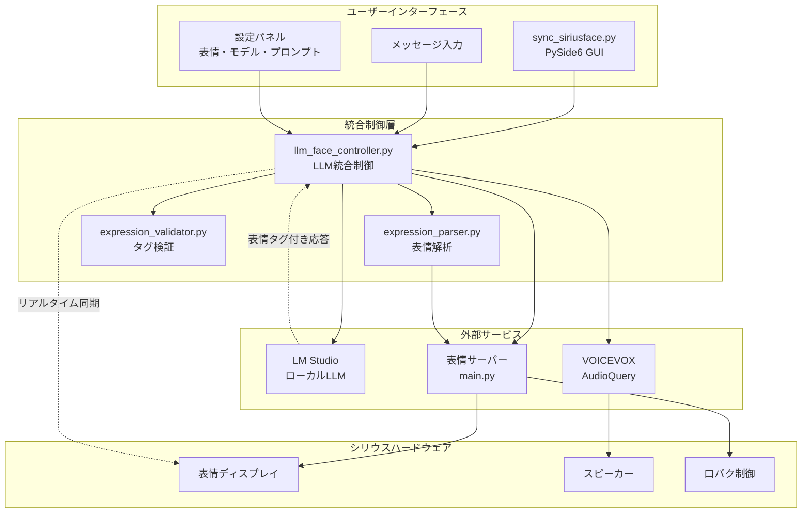

# 🎭 シリウス音声対話システム

ローカルLLM（LM Studio）とVOICEVOX AudioQuery音韻解析を統合した表情・音声対話システム

## 📋 目次

- [概要](#概要)
- [主な機能](#主な機能)
- [システム構成](#システム構成)
- [表情システム](#表情システム)
- [インストール](#インストール)
- [使用方法](#使用方法)
- [設定](#設定)
- [API仕様](#api仕様)
- [トラブルシューティング](#トラブルシューティング)

## 🎯 概要

シリウス音声対話システムは、屋外自律移動ロボット「シリウス」のための高度な音声対話システムです。ローカルLLMによる自然な会話と、表情タグによるリアルタイム表情切り替え、VOICEVOX AudioQueryによる高品質な音声合成・リップシンクを統合しています。

### 特徴

- 🤖 **ローカルLLM統合**: LM Studio経由でMistral等のモデルを使用
- 🎭 **リアルタイム表情制御**: 会話内容に応じた自動表情切り替え
- 🗣️ **高品質音声合成**: VOICEVOX AudioQueryによる自然な音声
- 👄 **精密リップシンク**: 音韻データに基づく口パク制御
- 🎨 **表情タグシステム**: LLM応答での感情表現
- 🖥️ **統合UI**: PySide6によるモダンなユーザーインターface

## ✨ 主な機能

### 🤖 音声対話機能
- ローカルLLMとの自然な日本語会話
- 会話履歴の管理（最大10件）
- 複数のプロンプト設定（カジュアル、技術的、教育的など）
- LLMモデル設定の動的変更

### 🎭 表情制御機能
- **10種類の表情モード**:
  - `neutral` - 普通・中立的
  - `happy` - 幸せ・喜び・明るい
  - `sad` - 悲しみ・残念・落胆
  - `angry` - 怒り・不満・イライラ
  - `surprised` - 驚き・意外・びっくり
  - `crying` - 泣く・とても悲しい
  - `hurt` - 痛み・困った・辛い
  - `wink` - 茶目っ気・いたずら・可愛い
  - `mouth3` - 特別な口の形・特殊な発音
  - `pien` - 困った・可愛く甘える

- **表情タグシステム**: `<happy>嬉しいです</happy>`形式でリアルタイム表情切り替え
- **自動タグ修正**: 不正な表情タグの自動検出・修正

### 🗣️ 音声・リップシンク機能
- VOICEVOX AudioQueryによる高品質音声合成
- 音韻データに基づく精密なリップシンク
- おしゃべりモードでの口パターン制御
- 表情変化と音声再生の同期

## 🏗️ システム構成

### システムアーキテクチャ



### コンポーネント構成

```
シリウス音声対話システム
├── 表情サーバー (sirius_face_anim/python/main.py)
│   ├── 表情制御API (HTTP)
│   ├── 口パク制御API
│   └── おしゃべりモード制御
├── 音声対話UI (LocalLLM_Test/sync_siriusface.py)
│   ├── PySide6 GUI
│   ├── LLMコントローラー統合
│   └── リアルタイム表情制御
└── LLM統合制御 (LocalLLM_Test/llm_face_controller.py)
    ├── LM Studio クライアント
    ├── VOICEVOX AudioQuery
    └── 表情・音声同期システム
```

### 主要コンポーネント

#### 1. 統合起動システム
- `launch_sirius_system.py` - 表情サーバーとUIの同時起動・監視
- `start_sirius_system.sh` - ワンクリック起動スクリプト

#### 2. 表情制御システム
- `expression_parser.py` - 表情タグ解析・リアルタイム制御
- `expression_validator.py` - 表情タグ検証・自動修正
- `phoneme_expression_sync.py` - 音韻ベース精密同期

#### 3. LLM統合システム
- `llm_face_controller.py` - LLM・表情・音声の統合制御
- `main.py` - LM Studio クライアント
- `prompt_tuning.py` - プロンプト管理システム

#### 4. UI・対話システム
- `sync_siriusface.py` - メイン音声対話UI
- `advanced_sync_siriusface.py` - 高度なUI機能

## 🎭 表情システム

### 表情タグ仕様

表情タグは `<表情名>テキスト</表情名>` の形式で使用します。

#### 基本的な使用例
```
<happy>こんにちは！</happy>今日は<surprised>とても良い天気</surprised>ですね。
でも明日は<sad>雨の予報</sad>です。<pien>傘を忘れないでくださいね</pien>。
```

#### 特殊表情の使用例
```
<mouth3>むにゃむにゃ</mouth3>...失礼しました。
<wink>ちょっとしたジョーク</wink>でした！
<pien>ちょっと困っちゃいました</pien>。
```

### 表情切り替えのタイミング
- LLM応答テキストの解析は即座に実行
- 表情変更は音声再生と同期
- セグメント単位でのリアルタイム切り替え
- 文字数ベースの時間推定（1文字約150ms）

## 🚀 インストール

### 前提条件
- Python 3.13+
- LM Studio（ローカルLLMサーバー）
- Node.js（フロントエンド用）
- macOS（テスト済み環境）

### 環境構築

1. **リポジトリクローン**
```bash
git clone https://github.com/YakiFrog/sirius_face_anim.git
cd sirius_face_anim
```

2. **LocalLLM_Test環境設定**
```bash
cd LocalLLM_Test
python -m venv .
source bin/activate  # macOS/Linux
# または
# . bin/activate

pip install -r requirements.txt
```

3. **sirius_face_anim環境設定**
```bash
cd ../sirius_face_anim/python
python -m venv .
source bin/activate

pip install -r requirements.txt
```

4. **依存パッケージ**
```bash
# LocalLLM_Test環境
pip install PySide6 requests numpy qasync

# sirius_face_anim環境  
pip install voicevox_core numpy requests websockets
```

## 🎮 使用方法

### 基本的な使用方法

#### 1. 統合システム起動（推奨）
```bash
cd LocalLLM_Test
./start_sirius_system.sh
```

#### 2. 個別起動
```bash
# 仮想環境アクティベート
cd LocalLLM_Test
source bin/activate

# 統合システム起動
python launch_sirius_system.py
```

#### 3. 手動起動（デバッグ用）
```bash
# 1. 表情サーバー起動
cd sirius_face_anim/python
source bin/activate
python main.py

# 2. 音声対話UI起動（別ターミナル）
cd LocalLLM_Test  
source bin/activate
python sync_siriusface.py
```

### UI操作方法

1. **メッセージ入力**: テキストエリアにメッセージを入力
2. **送信**: 
   - 送信ボタンクリック
   - Cmd+Enter（macOS）/ Ctrl+Enter（Windows）
3. **設定変更**:
   - **表情**: 初期表情を選択
   - **LLMモデル**: 使用するモデル設定
   - **プロンプト**: 会話の性格・スタイル
4. **履歴クリア**: 会話履歴をリセット

### プロンプト管理

利用可能なプロンプト：
- `sirius_expressions` - シリウス表情専用（推奨）
- `emotional` - 基本的な感情表現
- `casual` - カジュアルな会話
- `technical` - 技術的な対話
- `educational` - 教育的な説明
- `weather_guide` - 天気案内専用
- `news_reporter` - ニュース報道専用

## ⚙️ 設定

### 設定ファイル

#### `prompt_configs.json` - LLMモデル設定
```json
{
  "llm_settings": {
    "mistral_default": {
      "model": "mistralai/magistral-small-2509",
      "temperature": 0.7,
      "max_tokens": -1
    },
    "mistral_creative": {
      "model": "mistralai/magistral-small-2509", 
      "temperature": 0.9,
      "max_tokens": 200
    }
  }
}
```

#### プロンプトファイル（`prompts/`ディレクトリ）
- `*.txt` - 各プロンプトの内容
- 表情タグの使用ガイドライン含む
- カスタムプロンプトの追加可能

### 環境変数・パス設定

#### VOICEVOX設定
```python
voicevox_config = {
    "voicevox_onnxruntime_path": "/.../libvoicevox_onnxruntime.1.17.3.dylib",
    "open_jtalk_dict_dir": "/.../open_jtalk_dic_utf_8-1.11", 
    "model_path": "/.../13.vvm",
    "dialogue_file_path": "/.../dialogue_data.json"
}
```

#### サーバー設定
- **LM Studio URL**: `http://127.0.0.1:1234`
- **表情サーバーURL**: `http://localhost:8080`

## 📡 API仕様

### 表情制御API

#### 表情設定
```http
POST /expression
Content-Type: application/json

{
  "expression": "happy"
}
```

#### 口パターン設定
```http
POST /mouth_pattern  
Content-Type: application/json

{
  "mouth_pattern": "mouth_a"
}
```

#### おしゃべりモード設定
```http
POST /talking_mouth_mode
Content-Type: application/json

{
  "talking_mouth_mode": true
}
```

#### 状態取得
```http
GET /status

Response:
{
  "status": "success",
  "data": {
    "expression": "happy",
    "display_mode": "face", 
    "talking_mouth_mode": true,
    "mouth_pattern": "mouth_a",
    "is_blinking": true,
    "blink_interval": 3.0
  }
}
```

### LLM統合API

#### プログラム内部API
```python
# LLMFaceController使用例
controller = LLMFaceController()
result = await controller.process_user_input("こんにちは", "happy")

# 表情タグ付きテキストの発話
success = await controller.speak_with_lipsync(
    "<happy>嬉しいです</happy>",
    enable_expression_parsing=True
)
```

## 🧪 テスト

### テストスクリプト

```bash
# 表情システムテスト
python test_sirius_expressions.py

# 表情解析テスト
python test_expression_system.py

# 表情タグ検証テスト
python expression_validator.py

# LLMモデルテスト
python test_mistral_model.py
```

### 動作確認項目

1. **表情切り替え**: 各表情モードの正常動作
2. **音声合成**: VOICEVOX AudioQueryによる音声出力
3. **リップシンク**: 音韻データと口パクの同期
4. **表情タグ解析**: LLM応答の正確な解析
5. **自動タグ修正**: 不正タグの検出・修正

## 🔧 トラブルシューティング

### よくある問題

#### 1. 音声が出ない
- **原因**: VOICEVOX設定パスが不正
- **解決**: `llm_face_controller.py`のvoicevox_configを確認

#### 2. 表情が変わらない
- **原因**: 表情サーバー未起動 or 接続エラー
- **解決**: `python main.py`で表情サーバーを起動

#### 3. LLM応答がない
- **原因**: LM Studio未起動 or モデル未ロード
- **解決**: LM Studioでモデルをロードして起動

#### 4. 表情タグが認識されない
- **原因**: 不正なタグ形式
- **解決**: `<表情名>テキスト</表情名>`の正しい形式を使用

### ログ確認

```bash
# 統合システムのログ確認
python launch_sirius_system.py

# 個別コンポーネントのログ
python sync_siriusface.py  # UI側
python main.py            # 表情サーバー側
```

### デバッグモード

```python
# ログレベル変更
import logging
logging.basicConfig(level=logging.DEBUG)
```

## 📁 ファイル構成

```
LocalLLM_Test/
├── README.md                       # このファイル
├── launch_sirius_system.py         # 統合起動スクリプト  
├── start_sirius_system.sh          # シェル起動スクリプト
├── sync_siriusface.py              # メイン音声対話UI
├── llm_face_controller.py          # LLM統合制御
├── expression_parser.py            # 表情解析・制御
├── expression_validator.py         # 表情タグ検証
├── phoneme_expression_sync.py      # 音韻ベース同期
├── main.py                         # LM Studioクライアント
├── prompt_configs.json             # LLM設定ファイル
├── test_sirius_expressions.py      # 表情システムテスト
├── test_expression_system.py       # 表情解析テスト
├── prompts/                        # プロンプト管理
│   ├── sirius_expressions.txt      # シリウス表情専用
│   ├── emotional.txt               # 基本感情表現
│   ├── casual.txt                  # カジュアル会話
│   ├── technical.txt               # 技術対話
│   └── ...                         # その他プロンプト
└── bin/                            # Python仮想環境
```

## 🔮 今後の開発予定

### 短期的な改善
- [ ] 音韻ベース精密同期の実装
- [ ] 表情遷移アニメーションの追加
- [ ] 音声感情認識の統合
- [ ] エラーハンドリングの強化

### 中長期的な機能拡張
- [ ] 複数話者対応
- [ ] リアルタイム感情分析
- [ ] カスタム表情の追加
- [ ] 多言語対応（英語等）
- [ ] Web API化

## 📄 ライセンス

このプロジェクトは研究・教育目的で開発されています。

## 👥 貢献者

- 開発者: [YakiFrog](https://github.com/YakiFrog)
- プロジェクト: シリウス屋外自律移動ロボット

## 📞 サポート

問題や質問がある場合は、GitHubのIssuesを利用してください。

---

🎭 **シリウス音声対話システム** - より自然で感情豊かな対話を目指して
